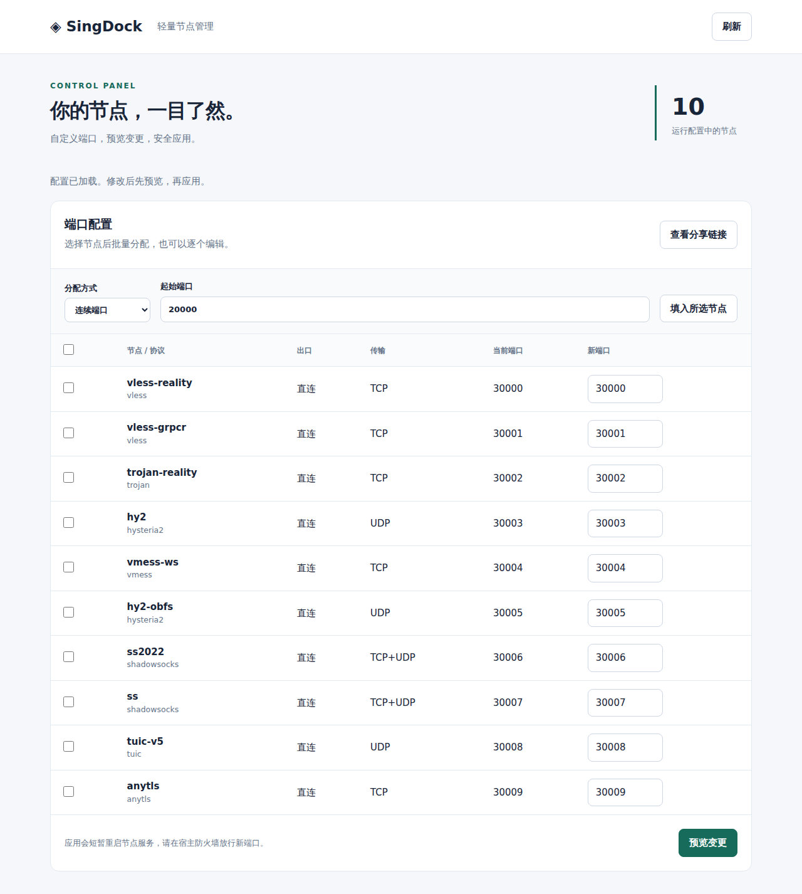
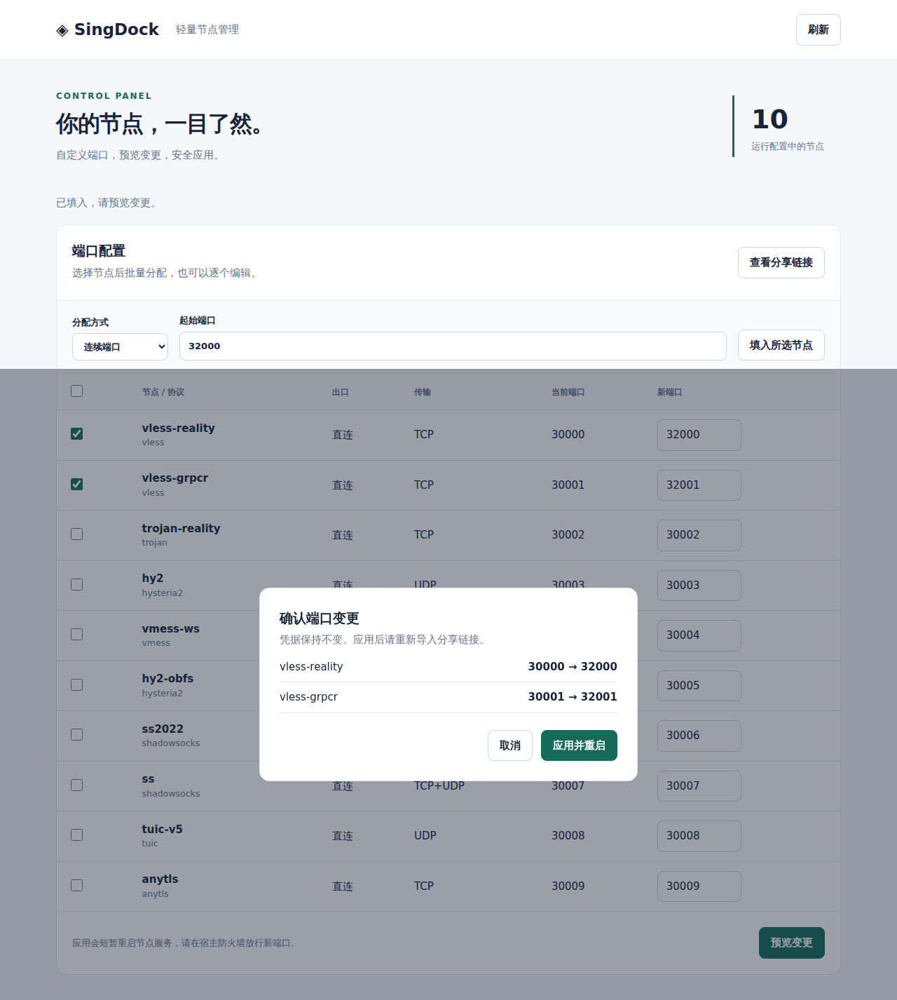
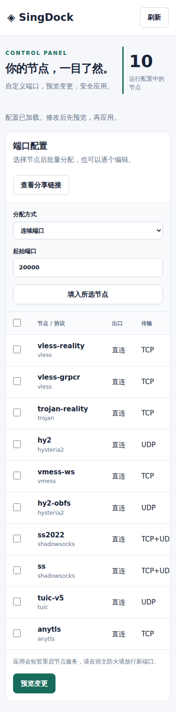

# SingDock

**用 Docker 部署多协议节点，在浏览器中管理端口。**

SingDock 将 [Sing-Box-Plus](https://github.com/Alvin9999-newpac/Sing-Box-Plus) 放进 Debian 容器，方便在 CentOS 7 等宿主机运行。保留上游节点配置和中文菜单，增加基于 Flask + Waitress 的轻量 GUI；一个容器即可运行，无需单独数据库。

## 核心功能

| 功能 | 能做什么 |
| --- | --- |
| 多协议节点 | 首次启动生成 10 个直连节点；支持 Reality、Hysteria2、Shadowsocks、VMess、TUIC 和 AnyTLS |
| GUI 管理 | 查看节点、协议、出口、TCP/UDP 传输和当前端口；支持桌面与手机访问 |
| 自定义端口 | 单节点编辑、连续端口批量分配、指定端口列表批量分配 |
| 预览与恢复 | 应用前展示新旧端口，检查重复/占用及配置有效性；重启失败恢复旧配置并尝试恢复服务 |
| 自定义登录 | 用户名、密码、管理端口和访问路径均可配置，例如 `/private/control/` |
| 分享链接 | 按需查看、复制客户端链接；修改端口后获取更新后的链接 |
| 持久化 | 重建镜像、重启容器保留节点端口、证书和凭据 |
| 可选 WARP | 开启后增加 10 个 WARP 出口节点；当前为实验性功能 |

## 界面预览

以下为 Chromium 浏览器实测截图，使用合成节点，不包含真实连接凭据。



<details>
<summary>查看端口变更预览</summary>



</details>

<details>
<summary>查看手机界面（节点表格支持内部横向滚动）</summary>



</details>

## 快速部署

宿主机需要 Docker 和 Docker Compose。默认使用 Linux **host 网络**，节点端口无需逐个映射。

```bash
git clone https://github.com/While-Shark/SingDock.git
cd SingDock
cp .env.example .env
```

编辑 `.env`：

```dotenv
PUBLIC_HOST=你的公网IP或域名
ENABLE_GUI=true
GUI_BIND=127.0.0.1
GUI_PORT=18100
GUI_USERNAME=你的管理用户名
GUI_PASSWORD=替换为至少16字符的独立强密码
GUI_PATH=/private/control
```

```bash
chmod 600 .env
docker compose up -d --build
docker compose exec singdock singdock ports
```

按 `ports` 输出在 VPS 安全组和宿主防火墙放行 TCP/UDP。节点数据保存在 `data/sing-box`；容器不会替你修改宿主防火墙或占用网站的 443 端口。

### 打开 GUI

默认只监听 VPS 本地回环地址。通过 SSH 隧道访问：

```bash
ssh -L 18100:127.0.0.1:18100 root@你的VPS地址
```

在本机打开 **`http://127.0.0.1:18100/private/control/`**，使用 `.env` 中的用户名和密码登录。

也可让宿主 Nginx 使用 **HTTPS** 反代 `http://127.0.0.1:18100`，保留完整路径，不剥离 `/private/control` 前缀。Basic 登录需要 SSH 隧道或 HTTPS 保护传输中的密码与分享链接。

## GUI 配置

| 配置项 | 默认值 | 说明 |
| --- | --- | --- |
| `ENABLE_GUI` | `false` | 是否启动 GUI |
| `GUI_BIND` | `127.0.0.1` | 监听地址；默认不向公网直接开放 |
| `GUI_PORT` | `18100` | 管理端口，1024–65535；不可使用 WARP 保留的 40000 |
| `GUI_USERNAME` | `admin` | 1–64 个字符，可使用中文；不可含冒号、控制字符或首尾空白 |
| `GUI_PASSWORD` | 无 | 必须设置；16–256 个字符，不可含控制字符，可含冒号 |
| `GUI_PATH` | `/` | 访问路径；例如 `/panel`、`/private/control`，支持字母、数字、`_`、`-` 和多级路径 |
| `PUBLIC_HOST` | 自动检测 | VPS 公网 IP 或域名，建议显式填写以确保分享链接正确 |

路径末尾 `/` 可省略，访问时会自动补齐。设置自定义路径后，原来的 `/`、`/api/*` 和静态资源入口不再提供 GUI。路径不替代登录保护。

修改以上配置后执行 `docker compose up -d --build`。旧部署未设置新字段时仍使用 `admin` 和 `/`；已有节点凭据会保留。

### 修改节点端口

1. 勾选节点，选择连续端口或填写逗号分隔的端口列表；列表按界面中的所选节点顺序对应。
2. 点击“填入所选节点”，也可直接逐行编辑新端口。
3. 点击“预览变更”，检查新旧端口，再“应用并重启”。
4. 放行 VPS 防火墙/安全组，获取新分享链接并更新客户端。

端口范围为 1024–65535，不允许重复或使用 GUI/WARP 保留端口。WARP 未开启时只显示直连节点。应用会短暂断开连接；bridge 网络用户还需同步修改 Docker 发布端口。

## 已有部署更新

先备份，再更新代码并重建：

```bash
umask 077
docker compose stop
tar -czf singdock-backup.tar.gz .env data
docker compose start
git pull --ff-only
docker compose up -d --build
```

备份包含节点密钥、GUI 密码和 WARP 身份，请妥善保管。`docker compose down` 不会删除绑定目录中的数据。

<details>
<summary>命令行管理与全部协议</summary>

```bash
docker compose exec singdock singdock menu
docker compose exec singdock singdock links       # IPv4/域名链接
docker compose exec singdock singdock links 6     # IPv6 链接
docker compose exec singdock singdock ports
docker compose exec singdock singdock status
docker compose exec singdock singdock check
docker compose exec singdock singdock restart
docker compose exec singdock singdock rotate-ports
```

包含 VLESS Reality、VLESS gRPC Reality、Trojan Reality、Hysteria2、VMess WebSocket、Hysteria2 Salamander、Shadowsocks 2022、Shadowsocks、TUIC v5、AnyTLS。内核固定为 `v1.13.7`，客户端需要支持所选协议。自签名证书协议需按客户端要求配置信任。BBR 在宿主机设置，容器不修改宿主 systemd。

</details>

<details>
<summary>可选 WARP（实验性）</summary>

在阅读并接受 [Cloudflare 条款](https://www.cloudflare.com/application/terms/) 后，在 `.env` 设置：

```dotenv
INSTALL_WARP=true
ENABLE_WARP=true
WARP_ACCEPT_TOS=true
```

执行 `docker compose up -d --build`。WARP 在同一容器内通过 `127.0.0.1:40000` 提供代理，注册信息持久化。初始化或出口检查失败会停止启动，不回退为直连。

AMD64/ARM64 的 WARP 镜像构建及二进制检查已通过；注册、连接、CentOS 7/ARM64 上的实际出口及 UDP 目标仍需实测。不要直接给 host 网络容器增加 `NET_ADMIN` 或 privileged。

</details>

<details>
<summary>验证、故障排查与实现边界</summary>

- [Container CI](https://github.com/While-Shark/SingDock/actions/workflows/container.yml)：AMD64/ARM64、bridge/host，检查启动、凭据持久化、GUI 登录、预览、真实服务重启和 10 种节点的客户端 → 代理 → HTTP 链路。Reality 使用隔离的本地 TLS 1.3/H2 目标。
- [GUI Browser CI](https://github.com/While-Shark/SingDock/actions/workflows/gui-browser.yml)：1280px 桌面和 390px 手机，覆盖批量配置、取消/应用预览、过期配置错误、链接复制和关闭清理；增加默认路径/账号与自定义路径/账号两组测试。合成节点截图保存在 `gui-browser-screenshots-*` 产物中，保留 7 天。
- 持久化节点设置通过白名单数据解析，不执行 `source`；可写数据目录不进入执行 PATH。GUI 对登录失败限流，通过 Waitress 限制线程、连接、请求头和请求体，拒绝冲突请求长度。反代下限流按实际连接地址计数，不信任可伪造的转发头。
- GUI 列表不返回密码、私钥或 UUID；分享链接含客户端凭据，按需读取。界面不需要 Docker socket，包含登录校验、跨站写入拦截、文件锁、过期预览检测和静态文件白名单。
- 配置及回滚备份使用 600 权限。端口/配置分别原子替换；强制终止容器可能需要用 `.bak` 恢复。探测与重启间的端口抢占会由失败回滚处理。
- 查看 `docker compose logs --tail=200` 和 `singdock status`；配置问题执行 `singdock check`。
- CentOS 7 用户已实测 VLESS 连通。Docker 共享宿主内核，其他协议/WARP 在目标 VPS 的可用性仍受内核、Docker/containerd/libseccomp 和客户端支持影响。优先更新旧运行时，不自动关闭 seccomp。
- SELinux 挂载使用 `:Z`，数据目录供单个容器使用，不与多个副本共享。
- 后端测试：先用 Python 3.11+ 创建虚拟环境并 `pip install -r requirements.txt`，再运行 `python -m unittest discover -s tests -p 'test_*.py' -v`。容器自动安装锁定依赖，并通过 Supervisor 启动 Waitress；不使用 Flask 开发服务器。
- 完整本地测试：`docker build -t singdock:test .` 后运行 `bash tests/smoke.sh singdock:test bridge` 或 `host`。host 测试临时使用本机端口及 `127.0.0.1:443`，请在测试机器运行。

上游信息与适配方式见 [UPSTREAM.md](UPSTREAM.md)。不在每次启动时下载执行远程脚本，不自动同步上游；升级前可记录 `git rev-parse HEAD` 以便回退。

</details>

安全扫描范围、修复和剩余边界见 [SECURITY.md](SECURITY.md)。
